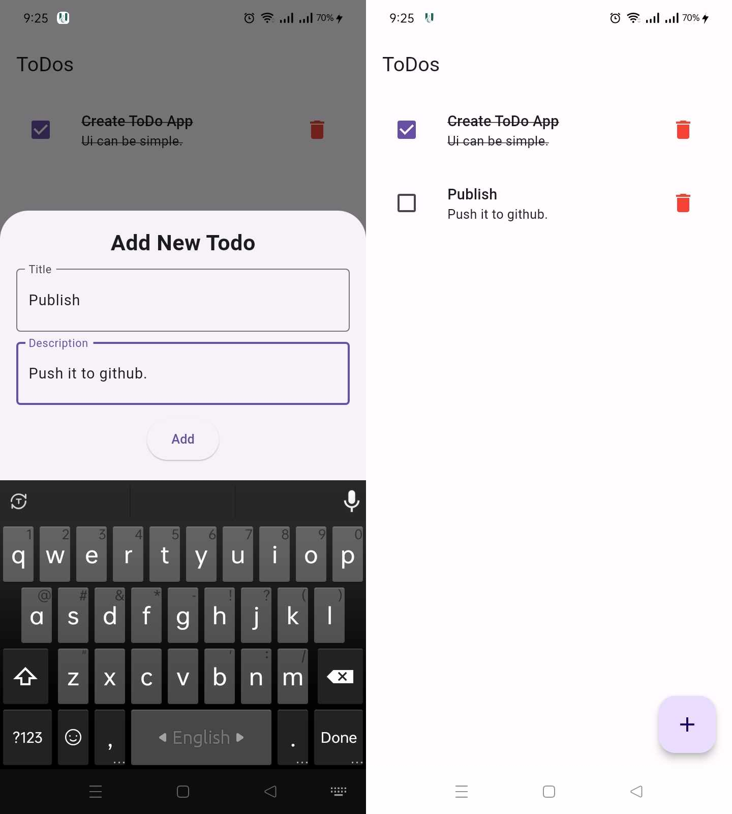

# Todo List With BloC and SharedPreference

## Table of Contents
- [User Interface](#user-interface)
- [Functionality](#functionality)
- [Bonus](#bonus)
- [State Mangement](#state-management-bloc)
- [Project Structure](#structure)
- [How to Run/Test](#how-to-run-the-project)


-------


## User Interface

Download the Apk

You can download the latest version of the app from the following link:
- [Download APK](https://github.com/naimurhasan/todo_bloc_and_sharedpref/releases/download/beta-0.0.1/release-0.0.1.apk)

<table>
  <tr>
    <td>
    <p>Todo App With BloC and SharedPreference<br/>
      </p>
    </td>
  </tr>
</table>



## Functionality

|   | Basic |
|---|-----------|
| ✔️ | Display list of tasks. |
| ✔️ | Ui to add a new task |
| ✔️ | Task can be marked as complete |

|   | Bonus |
|---|-----------|
| ✔️ | Persistence |
| ✔️ | Validation |
| ✔️ | UI Polish |


## State Management: BLoC

BloC | MVP

#### Versions

- [flutter_bloc](https://pub.dev/packages/flutter_bloc) - version 7.0.0

## Dependency
- Flutter: 3.19.3
- Java: 20.0.2

## Structure
Project Structure
```
├── core
│   └── utils
│       └── constants.dart
├── features
│   └── todo
│       ├── data
│       ├── domain
│       │   ├── model
│       │   └── repository
│       └── presentation
│           ├── TodoView.dart
│           ├── bloc
│           └── widget
├── di_module.dart
└── main.dart
```


## How to run the project 

Make sure you've flutter installed and check flutter is okay with `flutter doctor` then,

1. Clone this repository to your local machine using the following command:

```git clone https://github.com/naimurhasan/todo_bloc_and_sharedpref.git```

2. Navigate to the project directory:

```cd todo_bloc_and_sharedpref```

3. Install the project dependencies by running the following command:

flutter pub get

## Running the Project

To run the project locally, follow these steps:

1. Ensure that you have a simulator/emulator or a physical device connected to your machine.

2. Start the simulator/emulator or connect your physical device.

3. Run the project using the following command:

```flutter run```

This will build and launch the app on the connected device.

### Test
To run test you can `flutter test test/unit_test.dart`


## Getting Started with Flutter?

This project is a starting point for a Flutter application.

A few resources to get you started if this is your first Flutter project:

- [Lab: Write your first Flutter app](https://docs.flutter.dev/get-started/codelab)
- [Cookbook: Useful Flutter samples](https://docs.flutter.dev/cookbook)

For help getting started with Flutter development, view the
[online documentation](https://docs.flutter.dev/), which offers tutorials,
samples, guidance on mobile development, and a full API reference.
